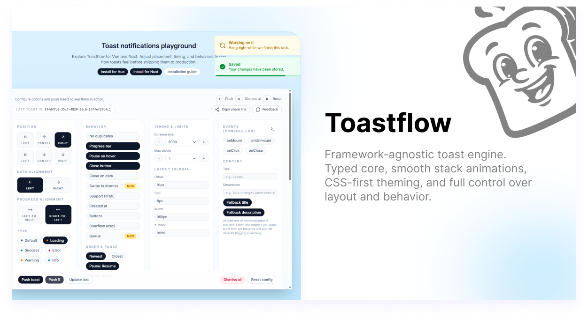

# nuxt-toastflow

Nuxt module wrapper for `vue-toastflow` so Toastflow works out of the box in Nuxt.

## Install

```bash
pnpm add nuxt-toastflow
```

## Usage

```ts
// nuxt.config.ts
export default defineNuxtConfig({
  modules: ["nuxt-toastflow"],
  toastflow: {
    config: {
      position: "top-right",
      duration: 5000,
    },
  },
});
```

```vue
<!-- app.vue -->
<template>
  <ToastContainer />
  <NuxtPage />
</template>
```

```vue

<script setup lang="ts">
  // Optional:
  // const toast = useToast();

  toast.success({
    title: "Saved",
    description: "Your changes are live.",
  });
</script>
```

## Options

```ts
type NuxtToastflowOptions = {
  config: Partial<ToastConfig>;
  css: boolean;
  componentName: string | false;
};
```

Defaults:

- `config: {}`
- `css: true`
- `componentName: "ToastContainer"`

`ToastContainer` is auto-registered as a client-only component by the module.
You can use either auto-imported `toast` (Vue-like API) or `useToast()`.

## License

MIT
